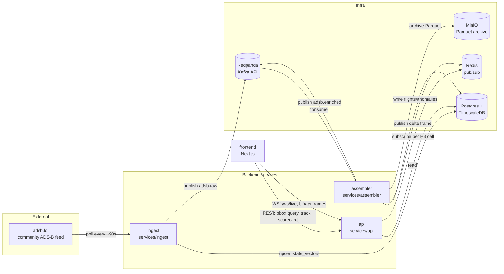

# Contrail — Architecture

This document explains *how Contrail is built*: the pieces, why each one exists, and why
each technology was chosen over the obvious alternatives. It assumes you've read the
one-paragraph pitch in the root [README](../README.md) but nothing else.

Two passes through everything here: first a plain-language version, then the technical
version. If a term is unfamiliar, it's explained the first time it's used.

---

## 1. The shape of the system, in plain language

Contrail has four jobs, and each one is a separate running program:

1. **Go fetch where airplanes currently are**, over and over, forever. (`ingest`)
2. **Turn a raw stream of "plane X is here" messages into something useful** — figure out
   if a plane just took off, is cruising, or just landed; estimate its fuel burn; decide
   what's worth showing live vs. archiving. (`assembler`)
3. **Answer questions from the outside world** — "what planes are over Texas right now?",
   "give me a live feed", "how good is your delay-prediction model?" (`api`)
4. **Show it to a person** — a web page with a live map. (`frontend`)

A fifth job, **train the ETA-prediction model**, doesn't run continuously — it's a script
you run on demand (`ml/train/train_eta.py`), not a service.

These four services don't talk to each other directly. They talk through shared
infrastructure sitting between them:

- A **database** (Postgres) that remembers things — airport locations, every position
  report ever received, trained model scorecards.
- A **message queue** (Kafka, via a Kafka-compatible system called Redpanda) that lets
  `ingest` publish "here's a new position report" without needing to know who's listening.
- A **fast in-memory cache/pubsub** (Redis) used specifically for fanning live updates out
  to however many browsers are currently watching the map.
- **Object storage** (MinIO, an S3-compatible system) that holds the full-resolution
  position history as compressed files, for later ML training.

The analogy: `ingest` is a reporter filing stories as they happen. Kafka is the newswire —
anyone can subscribe to it without the reporter knowing who's listening. `assembler` is an
editor who reads every story off the wire, decides what's newsworthy enough to push to
readers *right now* (Redis) versus what goes into the permanent archive (MinIO), and also
keeps the official record of "what happened" in the database. `api` is the newspaper's
public-facing desk — it's the only thing the outside world (the frontend) is allowed to
ask questions of directly.

## 2. The same shape, technically

Everything in **Backend services** is a plain Python process (no web framework needed for
`ingest`/`assembler` — they're just asyncio loops). Only `api` is a web server (FastAPI).
All three share code through `services/common/` — database connection setup, Kafka
producer/consumer factories, the binary WebSocket protocol, config loading, logging,
metrics. None of them duplicate that logic.

### Why a message queue between `ingest` and `assembler`, instead of `ingest` calling
`assembler` directly?

This is the single most important architectural decision in the streaming path, so it's
worth justifying explicitly:

- **Decoupling.** `ingest`'s job is "get data in," full stop. It doesn't need to know that
  something downstream computes flight phases, or that there's a live map, or that
  anomalies get detected. If `assembler` crashes, `ingest` keeps writing to Kafka — nothing
  is lost, and `assembler` catches up from where it left off (Kafka remembers *offsets*,
  i.e. "how far has each consumer read").
- **Replay.** Because Kafka is a durable log, not just a notification bus, a brand-new
  consumer (say, the not-yet-built M1 trajectory-model training job) can be pointed at the
  same `adsb.raw` topic and read the entire history from the beginning, without `ingest`
  doing anything different.
- **At-least-once + idempotent writes.** `ingest` publishes every raw report to Kafka
  (`publish_batch` in [`services/ingest/main.py`](../services/ingest/main.py)), not
  deduplicated — the log is meant to be the complete record. `assembler` commits its Kafka
  offset only *after* its database/Redis/Parquet writes for a message succeed
  ([`services/assembler/main.py`](../services/assembler/main.py)'s `run()` loop), so a
  crash mid-batch just means some messages get reprocessed on restart — which is safe,
  because every downstream write is itself keyed to be idempotent (`(icao24, ts)` as a
  natural primary key, `ON CONFLICT DO UPDATE` upserts).

The alternative — `ingest` calling `assembler`'s logic as a function, in-process — would be
simpler to build and would work fine at this scale. It would *not* survive a restart
without losing in-flight data, and it would couple the two services' deploy lifecycles
together. The queue costs you one more moving part (Redpanda) in exchange for "a crash in
one service doesn't corrupt or drop the other's work."

### Why Redis pub/sub for the *live* feed, separate from Kafka?

Kafka is for durable, replayable history. The live map doesn't want history — a browser
that just connected only cares about updates from *now* onward, and if it misses one
because it was reconnecting for half a second, that's fine, the next one arrives in a
couple of seconds anyway. Redis pub/sub is the right tool for "broadcast this to whoever's
currently listening, don't remember it for anyone who wasn't": it's fast, and nobody is
paying the cost of Kafka's durability guarantees for data that's intentionally disposable.

The subscription is **scoped per H3 cell** (`services/common/geo.py`'s `latlon_to_h3`,
resolution 5 — hexagonal grid cells covering the US at roughly county-sized resolution).
`assembler` publishes each delta to a channel named after the cell it's in
(`services/assembler/sinks/live_fanout.py`); the API's WebSocket handler
(`services/api/ws/live.py`) subscribes a connected browser only to the cells covering its
current map viewport. This is why panning the map doesn't flood your connection with
aircraft on the other side of the country — you're never subscribed to that data in the
first place, not "subscribed but filtering client-side."

---

## 3. Every major technology: what, why, and the road not taken

### Backend language & framework — Python 3.11 + FastAPI

**What:** Python is the implementation language for every backend service; FastAPI is the
web framework used only by `api` (the other two services are plain asyncio, no HTTP
framework at all).

**Why Python:** The project's ML stack (LightGBM, pandas, eventually PyTorch) is Python-
native, and OpenAP (the fuel-burn model used in `services/assembler/enrich.py`) is a Python
library with no equivalent elsewhere. Writing the data pipeline in Python means the exact
same feature-computation code can be shared between live inference and offline training —
see `services/common/features/eta.py`, imported by both `ml/datasets/eta.py` (training) and
(eventually) a live-serving path, so the two can never silently drift apart.

**Why FastAPI specifically:** Async-native (matches the asyncio-everywhere style of the
other services), automatic request validation from type hints via Pydantic, and native
WebSocket support without a separate library — all three routers and the `/ws/live`
endpoint live in the same app with no bridging code.

**Alternatives considered / why not:**
- **Go or Rust** for the ingest/assembler path would give better raw throughput and a
  smaller memory footprint — genuinely the right call at a much larger scale. At CONUS
  scale (thousands, not millions, of aircraft) Python's overhead isn't the bottleneck;
  the ADS-B feed's own rate limits are (see ADR 0003). Paying Go/Rust's steeper
  development cost here wouldn't have bought anything yet.
- **Django** — batteries-included, but its ORM and sync-first request model fight against
  an async, append-mostly, no-admin-panel-needed service like this one. FastAPI +
  SQLAlchemy async gives finer control with less unused machinery.
- **Flask** — no built-in async support or request validation; would mean hand-rolling
  what FastAPI + Pydantic already give for free.

### Database — PostgreSQL 16 + TimescaleDB + pgvector

**What:** One Postgres instance with two extensions loaded: TimescaleDB (turns a regular
table into a *hypertable* — automatically partitioned by time, with built-in retention and
pre-computed rollups) and pgvector (stores and indexes high-dimensional vectors for
similarity search).

**Why Postgres at all:** It's the one database that can be simultaneously: a reliable
transactional store (flight records, model registry — things that must never half-write),
a time-series store (millions of position reports a day), and a vector store (trajectory
embeddings for "find similar flights," a Stage 5+ feature). Running three specialized
databases instead — a time-series DB, a relational DB, a vector DB — would mean three
operational surfaces, three backup strategies, and application code that has to keep them
consistent by hand.

**Why TimescaleDB specifically, not raw time-partitioned Postgres tables:** `state_vectors`
(the position-report table) is declared a *hypertable* via
`migrations/versions/0001_initial_schema.py`'s `SELECT create_hypertable(...)` calls, with:
- **Compression** policies that shrink old chunks automatically.
- **Retention** policies that drop data past a configured age (the raw high-frequency table
  isn't meant to be the permanent archive — the Parquet sink in `services/assembler/sinks/
  parquet.py` is, specifically because object storage is far cheaper per GB than a live
  database's disk).
- **Continuous aggregates** (`state_vectors_15s`, `state_vectors_60s`) — materialized,
  incrementally-updated rollups, so a query like "average altitude per minute over the last
  week" doesn't have to scan every raw row.

Hand-rolling this with plain `PARTITION BY RANGE` tables would mean writing and maintaining
your own chunk-creation, compression, and rollup jobs — TimescaleDB is exactly that, already
built and tested.

**Why pgvector:** `trajectory_embeddings` stores a 64-dimensional vector per flight leg
(an IVFFLAT index for approximate nearest-neighbor search is already created in the
migration, even though nothing writes real embeddings yet — that's Stage 5+ work). Running
a separate vector database (Pinecone, Weaviate, Milvus) for this one feature, when
everything else already lives in Postgres, would be adding an entire new system for a
single table.

**Alternatives considered:**
- **MongoDB** — explicitly forbidden by the project's own spec
  (`docs/CONTRAIL_MASTER_SPEC.md`) without a written ADR justifying it; a document store
  buys nothing here since the schema is genuinely relational (flights reference airports,
  anomalies reference flights, etc.) and time-series workloads are what Postgres+Timescale
  are specifically good at.
- **InfluxDB / a dedicated time-series DB** — good at the time-series part, bad at the
  relational part (flights, airports, the model registry) and has no equivalent of
  pgvector. Would mean splitting the data model across two databases for no real gain at
  this scale.

### Messaging — Redpanda (Kafka-API-compatible)

**What:** A message broker that speaks the same wire protocol as Apache Kafka, so any
Kafka client library (here, `aiokafka`) works against it unmodified.

**Why Redpanda instead of real Kafka:** Kafka needs either a separate ZooKeeper cluster or
its newer KRaft consensus mode, plus JVM tuning, to run well — heavy for a project meant to
run on a single Docker Compose host. Redpanda is a single, self-contained binary (written
in C++, no JVM) that's wire-compatible with Kafka clients, so `services/common/bus.py`
would work completely unmodified against a real Kafka cluster later if the project ever
needed one. You get Kafka's semantics (durable log, consumer groups, offset-based replay)
without its operational weight at small scale.

**Alternatives considered:**
- **RabbitMQ** — a different model (routed message queues, not a durable replayable log).
  Loses the "any new consumer can replay all of history" property that Kafka's log gives
  for free, which this project explicitly wants (the plan is for a future training job to
  read the entire `adsb.raw` history from the beginning).
- **Redis Streams** — Redis is already in the stack for pub/sub, so reusing it for durable
  messaging too is tempting. It lacks Kafka's maturity around consumer-group rebalancing
  and long-term retention/compaction at the volumes this project is aimed at eventually
  handling; keeping "disposable live fanout" (Redis) and "durable replayable log" (Kafka)
  as two distinct tools with two distinct jobs is a clearer design than overloading one.

### Object storage — MinIO

**What:** A self-hostable, S3-API-compatible object store. `services/assembler/sinks/
parquet.py` buffers sampled state vectors and periodically flushes them as Parquet files
to a MinIO bucket.

**Why MinIO instead of real AWS S3:** Same reasoning as Redpanda vs. Kafka — API-compatible,
runs as a local container, and any code written against it (`boto3`/any S3 client) works
unmodified against real S3 later. Local dev shouldn't require a cloud account.

**Why Parquet as the file format:** Columnar, compressed, and the standard format for the
Python data-science stack (pandas/Polars/PyArrow all read it natively with zero conversion
cost) — this is specifically the data that later feeds `ml/data/loaders/` for training. A
row-oriented format (CSV, JSON lines) would be larger on disk and slower to read back for
the columnar access patterns ML training actually does (read all values of a few columns
across millions of rows, not whole rows at a time).

### Frontend — Next.js 16 (React 19, App Router) + TypeScript

**What:** A single Next.js app with two pages: the live map (`/`) and the model scorecard
(`/scorecard`).

**Why Next.js/React:** deck.gl (the GPU-accelerated map-overlay library rendering
thousands of aircraft as a single draw call) is a React-first library with the deepest
community support there. Next.js's App Router gives file-based routing and static
prerendering for free — both pages are static-rendered at build time (confirmed by `npm
run build`'s own output: `○ (Static) prerendered as static content`) since neither needs
server-side data at request time — all live data arrives client-side over WebSocket/fetch.

**Why TypeScript, strict mode:** The binary WebSocket protocol
(`frontend/src/lib/ws-protocol.ts`) has to stay byte-for-byte in sync with its Python
counterpart (`services/common/ws_protocol.py`) — a mismatched field order or size would
silently corrupt every aircraft's position. Strict types don't catch cross-language
protocol drift by themselves, but they do catch a huge class of "I passed the wrong shape
of object between components" bugs that would otherwise only surface at runtime.

**Alternatives considered:**
- **A plain SPA (Vite + React, no Next.js)** — would work, loses prerendering and the
  App Router's conventions for free, for no real benefit since this project doesn't need
  Next's server-side data-fetching features (no page currently needs a server-rendered,
  per-request response — everything is either static or fetched client-side).
- **Svelte/Vue** — deck.gl and the broader geospatial-visualization ecosystem are much
  more mature in the React world; choosing a different framework would mean either less
  mature tooling or writing a thin React wrapper anyway.

### Live-feed state — Zustand; server state — TanStack Query

**What:** Two small, deliberately different-purpose state libraries. Zustand
(`frontend/src/lib/store.ts`) holds two pieces of pure UI state: the current map viewport
bbox, and which aircraft is selected. TanStack Query (`frontend/src/app/providers.tsx`)
manages the two REST-backed queries (aircraft track history, model scorecard) — caching,
loading/error states, retries.

**Why not just React's built-in `useState`/Context everywhere:** Context causes every
consumer to re-render on any change; at the scale of "re-render on every one of hundreds of
aircraft updates per second," that matters. Zustand's subscription model only re-renders
components that read the specific slice of state that changed.

**Why not route the live feed through TanStack Query too:** React Query's model is
"fetch, cache, maybe refetch on an interval" — it doesn't have a first-class concept of a
long-lived push connection like a WebSocket. The live feed is deliberately a hand-rolled
hook (`useLiveAircraftFeed` in `frontend/src/lib/ws-client.ts`) using plain `useState`/
`useRef`, not forced into a tool built for request/response fetching.

### Mapping — MapLibre GL + deck.gl; spatial indexing — H3

**What:** MapLibre GL renders the base map (an open-source fork of the pre-proprietary
Mapbox GL JS). deck.gl draws the aircraft on top as a single `ScatterplotLayer` — one GPU
draw call for every aircraft, rather than one DOM marker element per aircraft (which would
fall over well before a few hundred markers). H3 (Uber's hexagonal hierarchical spatial
index) is the system both the WS subscription scoping and the nearest-airport lookup use to
turn "a point" into "a cell ID that can be grouped/indexed/compared cheaply."

**Why H3 instead of a plain lat/lon bounding-box check:** A bounding box subscription would
need the server to check every connected client's box against every update — an O(clients ×
updates) comparison. With H3, the server instead maintains "who's subscribed to cell X" as
a simple map lookup (`live_channel(cell)` in `services/assembler/sinks/live_fanout.py`), and
publishing an update to cell X instantly reaches exactly the clients who asked for it — O(1)
per update, not O(clients). It also gives a natural, pre-computed unit for "nearest
airport" queries (`services/assembler/sinks/nearest_airport.py` bbox-prefilters candidate
airports by cell before doing exact haversine distance, instead of scanning every airport
in the country for every landing event).

### ML — LightGBM for M2 (ETA regression)

**What:** A gradient-boosted decision tree library, used to predict arrival delay from
pre-departure features (scheduled route, carrier, time of day, historical taxi time,
destination congestion — see `services/common/features/eta.py`).

**Why LightGBM over a neural network here:** The feature set is small, tabular, and mostly
categorical/numeric (not images, text, or sequences) — exactly the regime where gradient-
boosted trees reliably beat neural nets on both accuracy and training time, with far less
hyperparameter sensitivity. `docs/ml-report.md` shows the real, current result: LightGBM's
test MAE beats both baselines (predict-zero-delay, and propagate-the-departure-delay-
forward). A neural net would need substantially more data and tuning effort to match that,
for a tabular problem that doesn't play to a neural net's strengths (it has no sequence or
spatial structure here to exploit — that's what M1, the trajectory GRU, is for, which *is*
planned as a sequence model, correctly, since trajectories genuinely are sequences).

**Why OpenAP for fuel estimation, not a learned model:** OpenAP is a published, open
aircraft-performance model (drag/thrust physics by aircraft type) — using it means fuel
estimates are physically grounded from day one with zero training data required, versus
a learned model that would need real fuel-flow ground truth (which ADS-B data doesn't
contain) to be trustworthy at all.

### ML — a GRU with quantile heads for M1 (trajectory forecasting)

**What:** A 2-layer GRU (gated recurrent unit — a sequence model, simpler and faster to
train than an LSTM, well suited to short sequences) consuming a 55-60 second window of an
aircraft's recent kinematics, predicting position at five horizons (60s to 900s out) as
three quantiles ({0.1, 0.5, 0.9}) rather than one point estimate.

**Why a sequence model here, unlike M2:** Trajectory data genuinely has sequential
structure — an aircraft's next position depends on its recent velocity and turn-rate
history, exactly the pattern a recurrent model is built to exploit. This is the mirror
image of the LightGBM-vs-neural-net reasoning above: M2's features are flat and tabular
(no benefit from a sequence model); M1's input *is* a sequence (no benefit from a tree
model, which would have to be handed hand-engineered lag features to approximate what a
GRU learns directly).

**Why quantiles instead of a single predicted point:** A single number hides how
confident the model is — an aircraft in steady cruise is far more predictable 15 minutes
out than one turning onto final approach. Predicting {0.1, 0.5, 0.9} gives an actual
uncertainty cone (visualized on the live map as the gap between q10 and q90), and is
trained with pinball loss (an asymmetric loss that directly optimizes for calibrated
quantiles, not just point accuracy) rather than plain MSE/MAE.

**Why ONNX for serving, not loading the PyTorch model directly:** `services/inference/
trajectory.py` runs inference via `onnxruntime`, never importing `torch`. This keeps the
`api` service's own dependency footprint free of PyTorch (a genuinely heavy dependency)
— only the `ml` extras used for *training* need it. ONNX is also runtime-portable: the
same exported `.onnx` file would load in a non-Python serving process without any code
changes.

**Real result, reported honestly:** on the one-hour training window this model actually
has (see [ADR 0004](adr/0004-historical-trajectory-data-source.md)), the GRU does *not*
beat the constant-velocity dead-reckoning baseline the master spec requires as the bar to
clear — the baseline wins at every horizon with test coverage (60s/180s/300s; 600s/900s
have zero valid test windows from a window this short). Real aircraft in level cruise are
close enough to constant-velocity over these short horizons that dead reckoning is a
genuinely strong baseline, and one hour of training data wasn't enough for the GRU to
clear it. This is still served live and still produces a real calibrated-looking
uncertainty cone — it's just not yet more accurate than the physics it's competing
against, and the ADR's addendum explains why and what would plausibly fix it.

### ML — a diffusion graph convolution + temporal GRU for M3 (delay-propagation GNN)

**What:** A custom, from-scratch spatio-temporal graph neural network
(`ml/models/delay_gnn.py`) — not a third-party graph-learning library. Each layer
propagates every airport's features to its graph-connected neighbors (weighted by a
precomputed, row-normalized adjacency matrix), repeated over multiple "hops" so
information travels across the network in one pass; a shared-weight GRU then runs each
node's propagated-feature sequence forward in time.

**Why two separate adjacency matrices (flow, rotation), not one:** The master spec is
explicit that rotation edges (the same aircraft's inbound-arrival-to-outbound-departure
link) are "the mechanism that makes cascades realistic," distinct from scheduled flow
volume — a busy route between two airports and an aircraft physically delayed at one
airport and due to depart from it next are different propagation mechanisms, so the model
gets two separate weighted graphs to learn from, combined (not summed) in each layer so
it can weight them differently.

**Why a from-scratch implementation instead of PyTorch Geometric or DGL:** At this
project's graph size (~334 nodes, two dense adjacency matrices), the actual "diffusion
convolution" operation is a handful of matrix multiplications (`torch.einsum` calls) —
genuinely simpler to write directly than to add and learn a general-purpose graph
library's API for. This keeps the model's mechanism fully inspectable in about 100 lines,
which matters for being able to explain *exactly* what it's doing, not just that a
library did something graph-shaped.

**Real result:** `docs/ml-report.md` shows the GNN beating both required baselines —
substantially ahead of a historical-mean-by-(airport,hour,day-of-week) baseline, and by a
smaller but real margin ahead of LightGBM-plus-one-hop-neighbor-delay, which is the more
meaningful comparison (it isolates the value of the GNN's multi-hop graph propagation
specifically, not just "using a model at all").

### ML — a 1D convolutional autoencoder for M4's learned anomaly layer

**What:** A flight segment resampled to a fixed 128 points is compressed through
1D-convolutional encoder layers to a 64-dimensional embedding, then reconstructed by a
mirrored decoder; reconstruction error (and an `IsolationForest` fit on the embeddings)
is the anomaly score — a segment that looks unlike the "normal" shapes the autoencoder
was trained on reconstructs poorly or sits in a sparse region of embedding space.

**Why unsupervised, when the rules layer already exists:** The rules layer
(`services/inference/anomaly_rules.py`) catches specific, named patterns (an emergency
squawk, an unusually steep descent) that someone had to think of in advance. An
autoencoder trained only on "normal" flight shapes can in principle flag something
genuinely novel that no rule anticipated — that's the whole case for adding a learned
layer on top of rules at all. Whether it actually delivers that in practice is an
empirical question this project measures honestly, not assumes: see the real (currently
weak) result in `docs/ml-report.md` and the scope note in
[ADR 0004](adr/0004-historical-trajectory-data-source.md) about why that evaluation is
closer to "does the embedding agree with the rules" than the full BTS-incident-based
check the original spec describes.

### Monte Carlo conflict estimation for M5

**What:** `services/inference/conflict.py` prunes aircraft pairs by H3 grid proximity and
altitude band (cheap, before any model inference), then for surviving pairs samples 200
simulated trajectories per aircraft from M1's quantile predictions (treating {q10, q50,
q90} as defining a triangular distribution per axis) and checks closest-point-of-approach
across every sample.

**Why Monte Carlo instead of a closed-form probability:** Two aircrafts' predicted
positions are each a 3-quantile distribution at multiple horizons — there's no simple
closed-form formula for "probability these two uncertainty cones intersect" from just
three quantile points. Sampling is the standard, simple way to turn "I have some
predicted distribution" into "here's a probability of a joint event," without needing a
parametric assumption about the full shape of either distribution beyond what the three
quantiles already specify.

**Why a deterministic, seeded RNG, not Python's global `random`:** The master spec's
determinism requirement ("a single seeded RNG... no wall-clock reads") exists for the
counterfactual simulator, but this project applies the same discipline here too — the
same aircraft snapshot and predictions should always produce the same conflict
probability, which matters for testing (`tests/unit/test_conflict.py` asserts exactly
this) and for not having a live API endpoint's output silently vary between identical
requests.

### Stage 7, scoped down — a synchronous DES simulator against real BTS history

**What:** `services/simulator/engine.py` drives the already-built, already-tested
`SimClock` (`des/clock.py`) and single-runway queueing state machine (`des/runway.py`)
through a real demand sequence — every real scheduled arrival/departure at one airport on
one real BTS day (`services/simulator/demand.py`) — twice: once unperturbed (the
baseline), once with the scenario's `runway.close` perturbation applied, and diffs the
two. `services/simulator/network_ripple.py` separately reuses M3's already-trained
checkpoint, unmodified, to estimate the ripple at flow-connected neighbor airports. See
[ADR 0005](adr/0005-scoped-stage-7-simulator.md) for the full scope-reduction rationale
(no live-DB dependency, one representative runway per airport, synchronous not
job-queued, only `runway.close` executed).

**Why BTS history instead of a live snapshot:** this project has no live scheduled-flight
timetable anywhere (the same gap M3's live-serving docstring already names) — a
counterfactual has nothing real to perturb if it forks from a live snapshot with no real
demand behind it. `services/simulator/historical.py`'s `BtsReferenceData` implements the
exact same `ReferenceData` Protocol `services/simulator/spec.py`'s validator already
expected, so the same two-stage `ScenarioSpec` validation gates a historical scenario
exactly as it would a live one.

**Why the M3 coupling needed no retraining:** `DelayGNN.forward()` is a stateless
function of a feature tensor plus two fixed adjacency matrices — nothing about it is
coupled to a live data source. Zeroing out the affected airport's `ops_count`/
`cancellations`/delay features for the trailing buckets a closure would affect, then
comparing that forward pass's output to the real unperturbed history's, is a legitimate,
bounded reuse of the model's own learned propagation structure (the ADR states precisely
what this is and isn't claiming).

**A real performance bug found and fixed in this pass:** the first working version of
`network_ripple.py` called `ml.datasets.network.build_graph()` to get the airport list
for indexing — but `build_graph()`'s rotation-edge computation (a per-tail-number Python
loop over the full BTS month) cost ~107 of a ~114-second cold path, to compute two
adjacency matrices this module never uses (it always uses the trained checkpoint's own
adjacency for the actual forward pass). Fixed by building just the airport list directly
(`sorted(set(df.origin) | set(df.dest))`) and passing placeholder adjacency into
`build_arrays()`, which never reads adjacency values — cut the cold path to ~16 seconds.
That one-time cost is now paid at API startup (`services/api/main.py`'s lifespan, via a
background `asyncio.to_thread` task) rather than blocking whichever user's request
happens to arrive first; every request after the (cached) warmup completes in well under
100ms.

### Observability — Prometheus + Grafana, structlog

**What:** Prometheus scrapes `/metrics` off the API process and stores time-series metrics;
Grafana visualizes them. `structlog` (not Python's bare `logging`) produces structured JSON
log lines, configured once in `services/common/telemetry.py` and shared by every service.

**Why structured JSON logs instead of plain text:** JSON logs are machine-parseable without
a custom regex per log line — every `logger.info("event_name", key=value, ...)` call
becomes a queryable field, which matters once there's more than one developer or more than
a terminal's worth of log history to search through.

**Why Prometheus's pull model:** Each service doesn't need to know where a metrics
collector lives or push to it reliably — Prometheus just scrapes whichever targets are
configured (`infra/prometheus/prometheus.yml`). The honest caveat, found during this
session's verification: `ingest` and `assembler` define Prometheus metrics (e.g.
`CONSUMER_LAG`, `INGEST_MESSAGES_TOTAL`) but — unlike `api` — never start an HTTP server
to expose them, so those specific metrics aren't actually scrapeable yet. The dashboard
panels for them exist and are wired correctly; they'll show data once those two services
also expose a `/metrics` endpoint (a real, documented, not-yet-done piece of follow-up
work — see [Limitations](LEARNING_GUIDE.md#17-limitations-honestly) in the learning guide).

### Package/dependency management — `uv`

**What:** A fast, modern Python package manager/installer used instead of plain `pip`.
`pyproject.toml` defines the dependency groups (`ml`, `dev`), and the Makefile/CI both
install through `uv`.

**Why:** Dramatically faster dependency resolution/installs than pip, and a single tool
covers virtual environment creation and installation, reducing the number of moving pieces
in setup instructions.

### Orchestration — Docker Compose, not Kubernetes

**What:** Every service (`postgres`, `redis`, `redpanda`, `minio`, `api`, `ingest`,
`assembler`, `prometheus`, `grafana`) is a container defined in a single
`docker-compose.yml`, with healthchecks gating startup order.

**Why not Kubernetes:** The project's own spec explicitly rules this out without a written
ADR justifying the exception. Kubernetes' value is scaling *across many machines*; this
project runs as one Docker Compose stack on one host, where Kubernetes would add
substantial operational complexity (a control plane, manifests, often a separate ingress
layer) for zero benefit at the current single-host, single-replica-per-service scale. If
the project ever needed to run multiple `assembler` replicas or scale horizontally across
hosts, that would be the point to reconsider — and the code already documents this tradeoff
explicitly (`AssemblerState`'s docstring in `services/assembler/pipeline.py` notes the
in-memory per-process state is "acceptable for a single assembler replica... only matters
once Stage 3 needs more than one replica running").

---

## See also

- [Codebase walkthrough](CODEBASE_WALKTHROUGH.md) — file-by-file tour.
- [Data flows](DATA_FLOWS.md) — step-by-step traces of the major request/event paths.
- [Learning guide](LEARNING_GUIDE.md) — the project from zero, start here if you haven't
  already.
- [`docs/CONTRAIL_MASTER_SPEC.md`](CONTRAIL_MASTER_SPEC.md) — the original, full design
  spec this project is built against, including the 10-stage build plan.
- [`docs/adr/`](adr/) — Architecture Decision Records documenting real deviations made
  during development (CONUS-only scope, the `airplanes.live` source being deferred, and
  the hub-tiling rate-limit saga).
